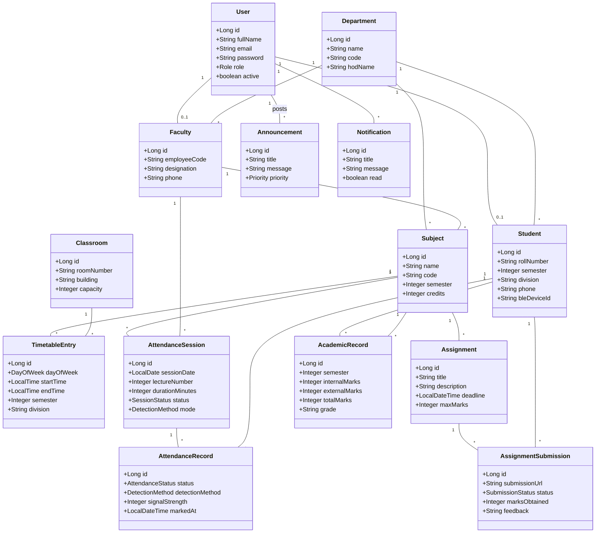
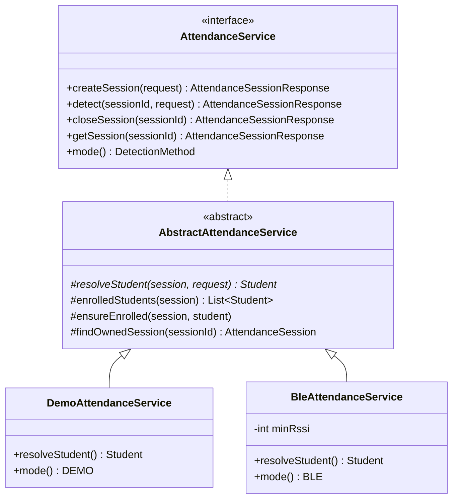
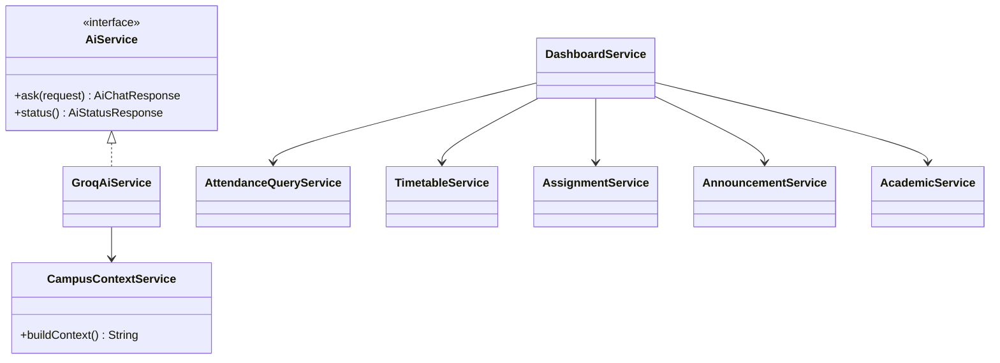

# Class diagram

## Domain model

## Attendance strategy

`DemoAttendanceService` is active when `app.attendance.mode=demo` (the default);
`BleAttendanceService` when it is `ble`. Exactly one bean exists at runtime, so
`AttendanceController` simply injects `AttendanceService`.

## Service layer

