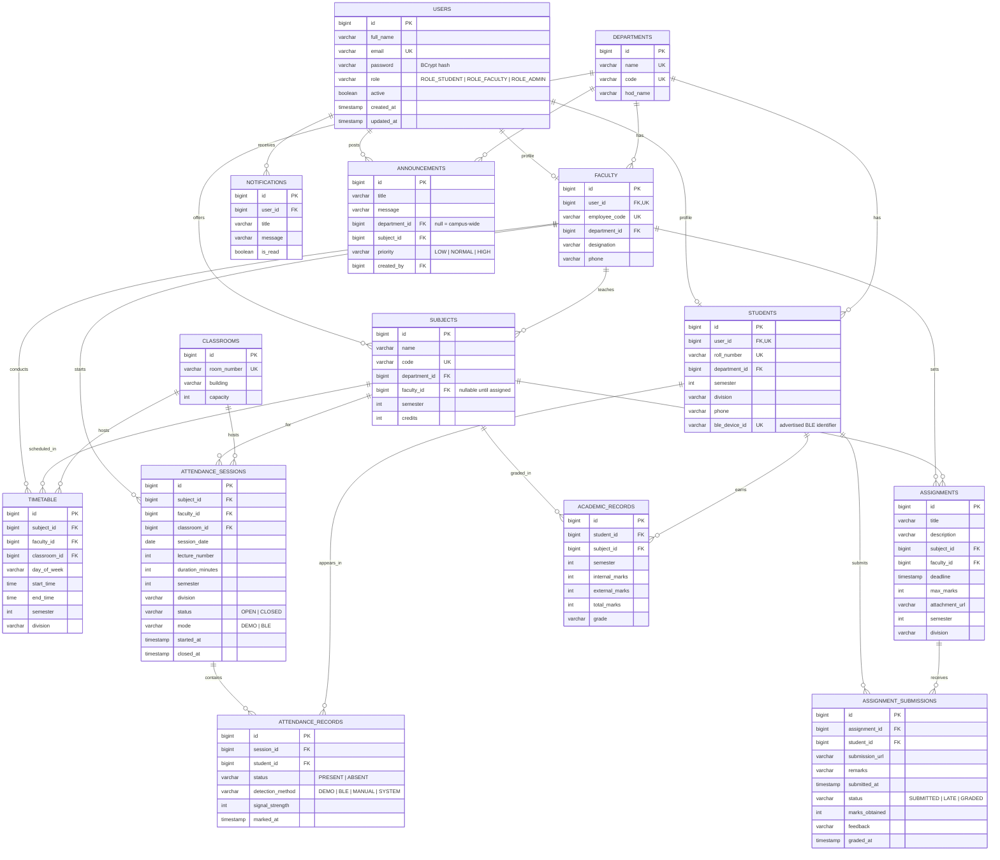

# Database design

PostgreSQL. The schema is generated from the JPA entities (`ddl-auto: update`), so the entity classes are
the single source of truth.

## ER diagram

## Constraints that carry business rules

| Constraint | Table | What it prevents |
|---|---|---|
| `uk_attendance_session_student` on `(session_id, student_id)` | `attendance_records` | Marking one student twice in one lecture, even if two detections race |
| `uk_submission_assignment_student` on `(assignment_id, student_id)` | `assignment_submissions` | Duplicate submissions; a resubmission updates the existing row |
| `uk_academic_student_subject_sem` on `(student_id, subject_id, semester)` | `academic_records` | Two conflicting mark sheets for the same subject |
| `uk_users_email` | `users` | Two accounts on one email |
| `uk_students_roll_number` | `students` | Two students on one roll number |
| `ble_device_id` unique | `students` | One device mapping to two students |

The database enforces these, not only the service layer, so a bug in application code cannot corrupt the data.

## Normalisation

The schema is in **3NF**:

- Every non-key column depends on the whole primary key.
- Repeating groups are separate tables (`attendance_records`, not columns on the session).
- Derived values are the deliberate exception: `total_marks` and `grade` are stored on `academic_records`
  because a mark sheet must reflect the rule that applied when it was published, even if the grade bands
  change later. They are always computed in `AcademicService`, never supplied by the client.

## Indexing

Unique constraints create indexes automatically, which covers the lookups that matter: email on login,
roll number on search, and `ble_device_id` on every BLE detection. Foreign keys are indexed by PostgreSQL
convention for the joins used by the dashboards.
