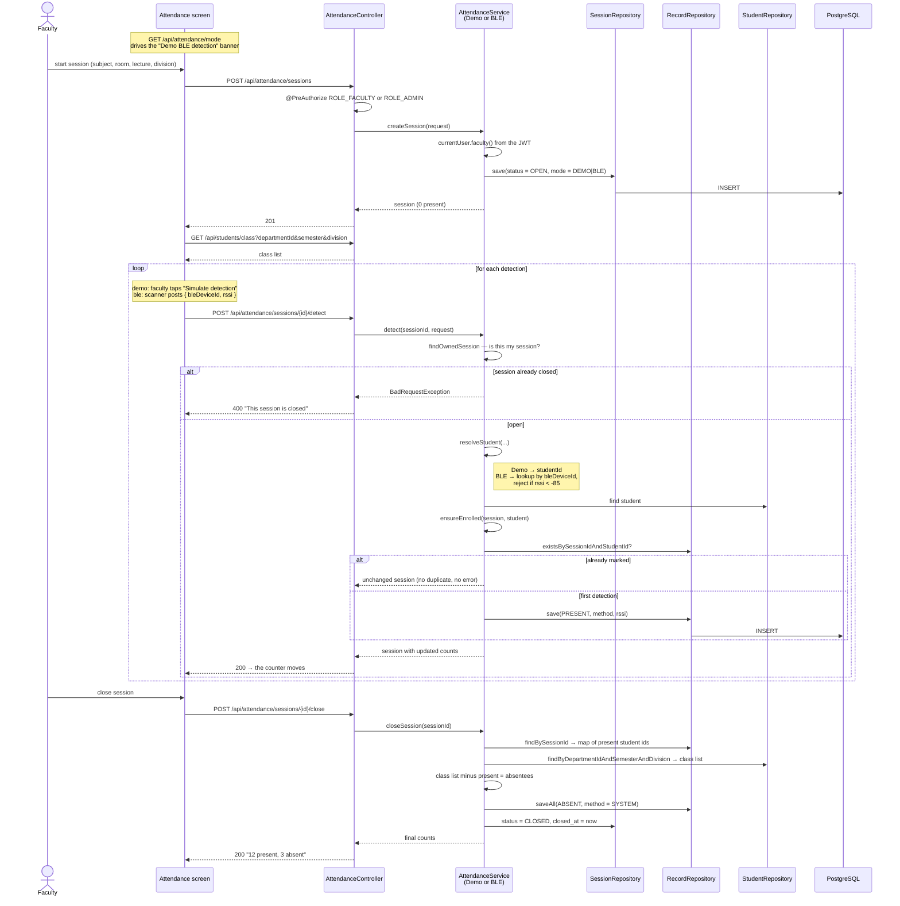
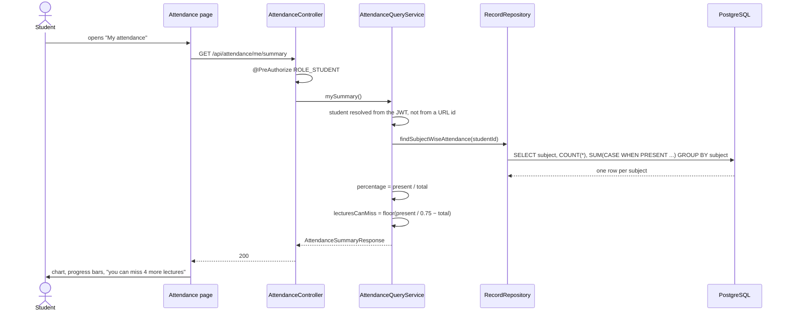

# Sequence: BLE attendance

## Full lifecycle

## Why closing is a separate step

Attendance is only complete when the lecture ends. Writing `ABSENT` rows up front and deleting them as
students arrive would mean far more writes and a window where the data is wrong. Closing once, at the end,
gives a single consistent picture and an accurate `closed_at` timestamp.

The absentee calculation uses a map of the students already present, so it is one pass over the class list
rather than a query per student.

## How a student sees the result

Because the student is taken from the token, `GET /api/attendance/student/99/summary` for someone else's id
returns `403` — the check is in `AttendanceQueryService.ensureCanView`, not in the browser.
