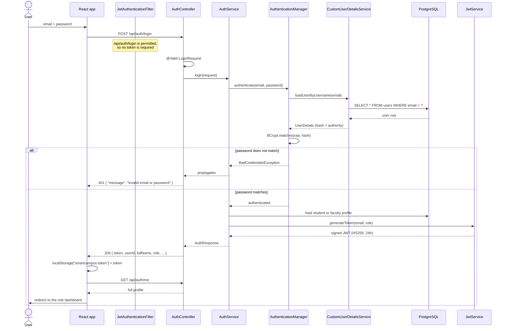
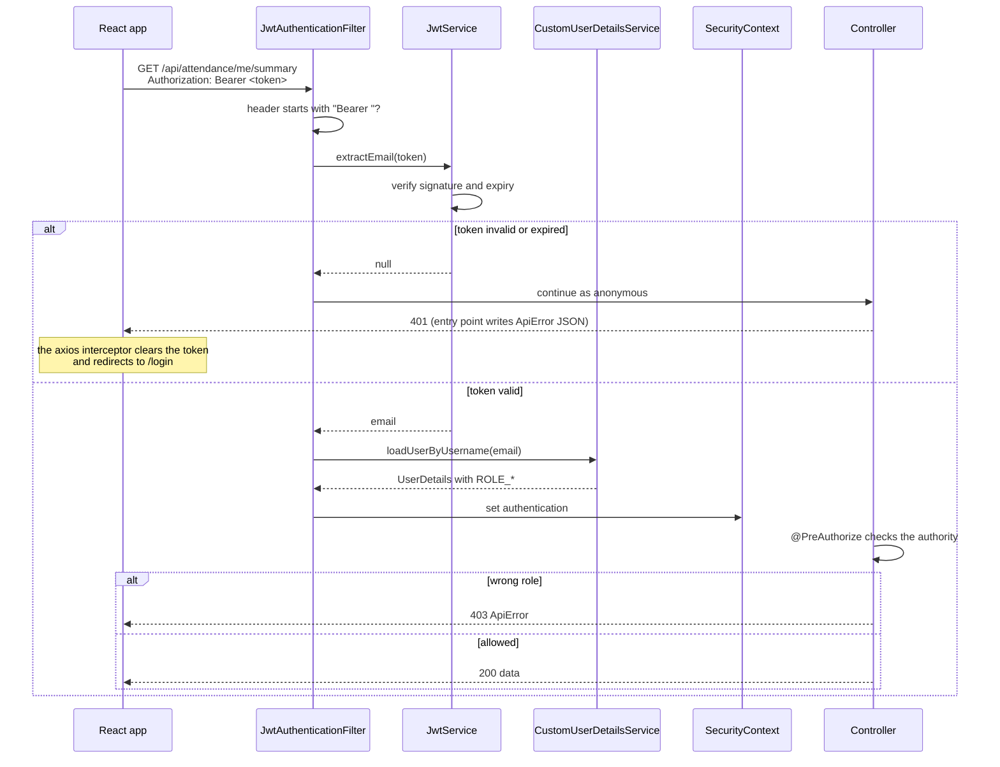
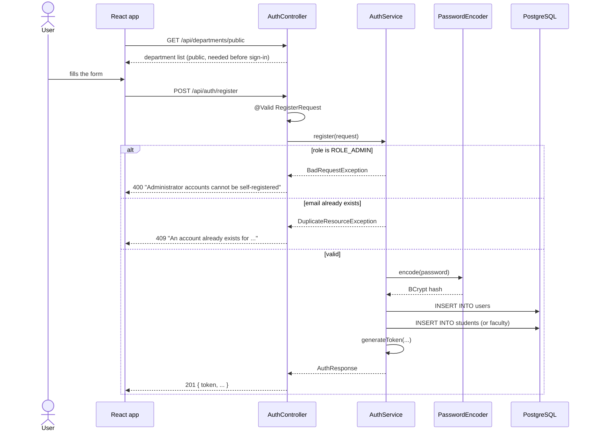

# Sequence: registration and login

## Login

```mermaid
sequenceDiagram
    actor U as User
    participant R as React app
    participant F as JwtAuthenticationFilter
    participant C as AuthController
    participant S as AuthService
    participant AM as AuthenticationManager
    participant UD as CustomUserDetailsService
    participant DB as PostgreSQL
    participant J as JwtService

    U->>R: email + password
    R->>C: POST /api/auth/login
    Note over F: /api/auth/login is permitted,<br/>so no token is required
    C->>C: @Valid LoginRequest
    C->>S: login(request)
    S->>AM: authenticate(email, password)
    AM->>UD: loadUserByUsername(email)
    UD->>DB: SELECT * FROM users WHERE email = ?
    DB-->>UD: user row
    UD-->>AM: UserDetails (hash + authority)
    AM->>AM: BCrypt.matches(raw, hash)

    alt password does not match
        AM-->>S: BadCredentialsException
        S-->>C: propagates
        C-->>R: 401 { "message": "Invalid email or password" }
    else password matches
        AM-->>S: authenticated
        S->>DB: load student or faculty profile
        S->>J: generateToken(email, role)
        J-->>S: signed JWT (HS256, 24h)
        S-->>C: AuthResponse
        C-->>R: 200 { token, userId, fullName, role, ... }
        R->>R: localStorage["smartcampus.token"] = token
        R->>C: GET /api/auth/me
        C-->>R: full profile
        R->>U: redirect to the role dashboard
    end
```

## Every request after login

```mermaid
sequenceDiagram
    participant R as React app
    participant F as JwtAuthenticationFilter
    participant J as JwtService
    participant UD as CustomUserDetailsService
    participant SC as SecurityContext
    participant C as Controller

    R->>F: GET /api/attendance/me/summary<br/>Authorization: Bearer <token>
    F->>F: header starts with "Bearer "?
    F->>J: extractEmail(token)
    J->>J: verify signature and expiry

    alt token invalid or expired
        J-->>F: null
        F->>C: continue as anonymous
        C-->>R: 401 (entry point writes ApiError JSON)
        Note over R: the axios interceptor clears the token<br/>and redirects to /login
    else token valid
        J-->>F: email
        F->>UD: loadUserByUsername(email)
        UD-->>F: UserDetails with ROLE_*
        F->>SC: set authentication
        C->>C: @PreAuthorize checks the authority
        alt wrong role
            C-->>R: 403 ApiError
        else allowed
            C-->>R: 200 data
        end
    end
```

## Registration

```mermaid
sequenceDiagram
    actor U as User
    participant R as React app
    participant C as AuthController
    participant S as AuthService
    participant E as PasswordEncoder
    participant DB as PostgreSQL

    R->>C: GET /api/departments/public
    C-->>R: department list (public, needed before sign-in)

    U->>R: fills the form
    R->>C: POST /api/auth/register
    C->>C: @Valid RegisterRequest
    C->>S: register(request)

    alt role is ROLE_ADMIN
        S-->>C: BadRequestException
        C-->>R: 400 "Administrator accounts cannot be self-registered"
    else email already exists
        S-->>C: DuplicateResourceException
        C-->>R: 409 "An account already exists for ..."
    else valid
        S->>E: encode(password)
        E-->>S: BCrypt hash
        S->>DB: INSERT INTO users
        S->>DB: INSERT INTO students (or faculty)
        S->>S: generateToken(...)
        S-->>C: AuthResponse
        C-->>R: 201 { token, ... }
    end
```
