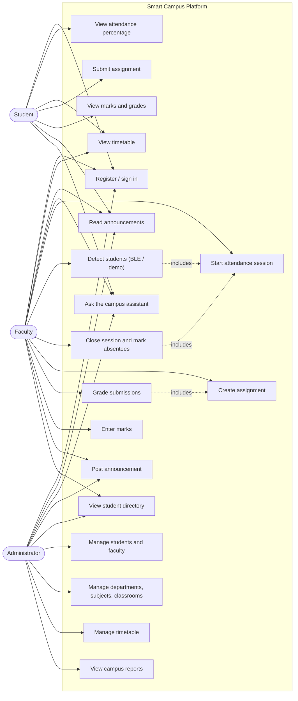

# Use case diagram

## Primary use case: take attendance

| | |
|---|---|
| **Actor** | Faculty |
| **Goal** | Record who attended a lecture |
| **Precondition** | Signed in as faculty; the subject is assigned to them |
| **Trigger** | The lecture begins |

**Main flow**

1. Faculty opens *Take attendance* and selects subject, classroom, lecture number, duration and division.
2. The system creates a session with status `OPEN` and shows the class list.
3. For each student detected (BLE advertisement, or a simulated tap in demo mode) the system records a
   `PRESENT` row with the detection method.
4. Faculty closes the session.
5. The system writes `ABSENT` for every student on the list who was never detected, sets the status to
   `CLOSED`, and updates the counts.

**Alternate flows**

- *3a.* The same student is detected twice → the unique constraint on `(session, student)` means the second
  detection changes nothing and no error is shown.
- *3b.* A detected student is not in this class → the request is rejected with a clear message.
- *3c.* In BLE mode the signal is weaker than the threshold → the detection is rejected as out of range.
- *4a.* Another faculty member tries to close the session → `403`.
